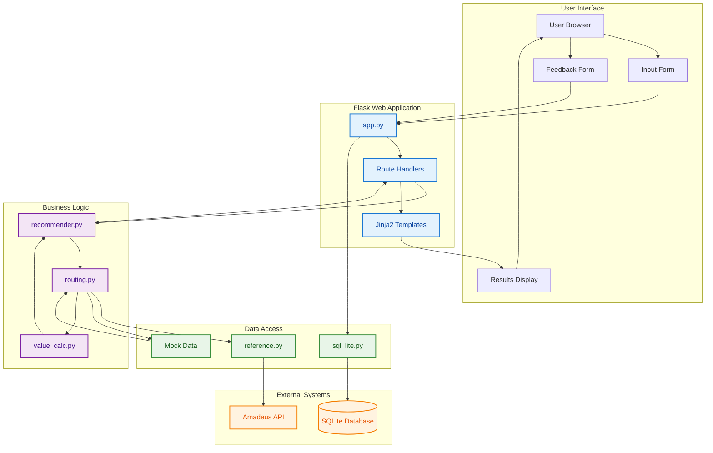
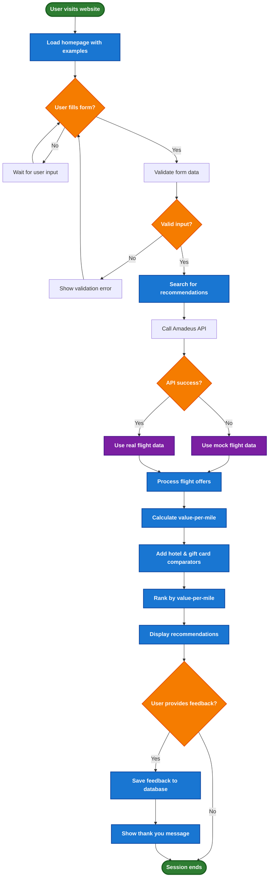
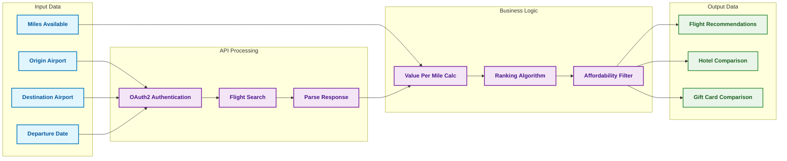
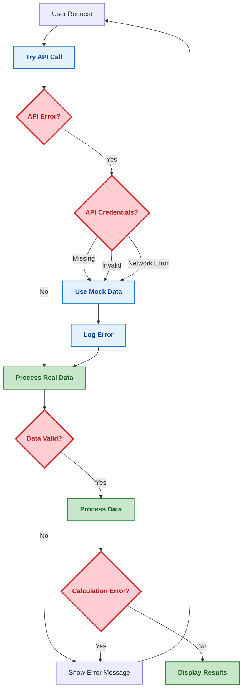
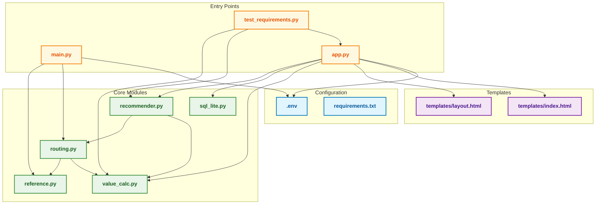
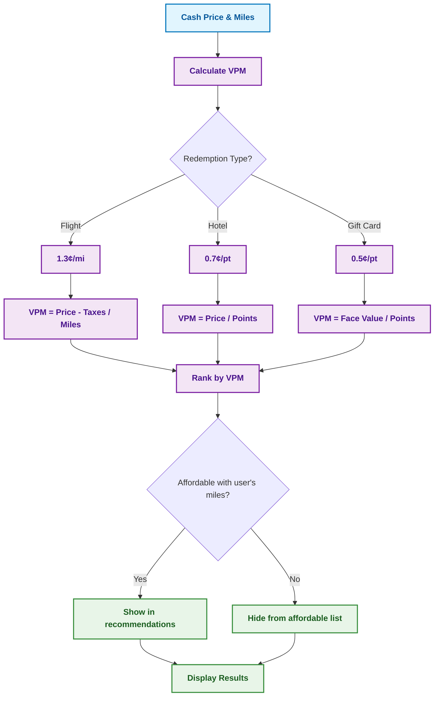

# Rove Synthetic - System Flowchart

## Complete System Architecture

## Detailed User Journey Flow

## Data Processing Flow

## Error Handling Flow

## File Dependencies Flow

## Value Calculation Flow

